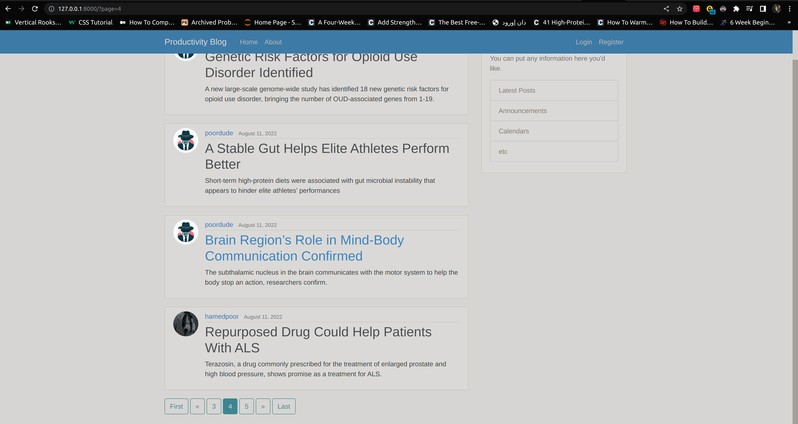

# Productivity Blog

<h3> Hi! This is a full-featured django blog about productivity and scientific stuff that you can register to it and post your articles.</h3>

<h3>• From register you can create an acount and you will redirect to home page with a flashy massage of success.</h3>
<h4> register from-model made by built-in django user model and a extensional email filed</h4> 

<h3>• When you create an acount you can login to it and you'll have a profile that you can update your infromation in there</h3>
<h4> with django singnals and a predfined profile-model, after creating a instance for User-model, profile atoumaticly create for that instance with default image profile in database.</h4> 

<h3>• As you see, after loging in, at top of the page "Create Post" section is available and you can post a new article with abillity of deleting or updating that post any time you want but you can't make changes on other users posts!</h3>
<h4> with django mixins and login_required decorator we personalize some accessibility</h4> 
<h4> CRUD functionality and unique url routing for each post provided by clase base views </h4> 

<h3>• And we can logout every time we want</h3>
<h4> django.auth has bilt-in LoginView and LougoutView classes that with seting url and making templete for them we can use their functionality.</h4>

<h3>• We have some pagination for our pages</h3>

<h3>• And this is how our admin pannel looks like </h3>

